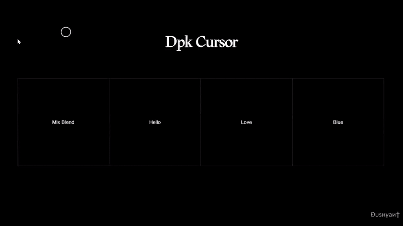

# dpk.js

#### 🤍 Collection of High Performance Super smooth functions that help you to create awwward winning websites.

#

<p align="left">        
    <a href="#">
        
    </a>
</p>
#

### How to use:

##### HTML

###

```html
<h1 class="dpk-hover" data-hover-text="Hello">Hi</h1>
or
<h1 class="dpk-hover" data-hover-emogy="💚">Hey</h1>
or
<h1 class="dpk-hover" data-hover-bg="#222">Hey</h1>

or hide the custome cursor
<h1 class="dpk-hover noCursor" data-hover-bg="#222">Hey</h1>
```

##### CSS

Add the dpkCursor.css

[download dpkCursor.min.css from CDN]

##### JS

Add the dpCursor.min.js

[download dpkCursor.min.js from CDN]

##### dpkCursor Provides Following Functions

#

| Name              | Parameter            | Defaults         | Desc            |
| ----------------- | -------------------- | ---------------- | --------------- |
| `initCursor()`    | (speed, "Gsap Ease") | 0.13, 'sine.out' | initialization  |
| `cursorEffects()` | -                    | -                | Use the Effects |
| `resetCursor()`   | -                    | -                | reset dpkCursor |

#

```js
<script src="dpkCursor.min.js"></script>
<script>
    initCursor();
    cursorEffects();
</script>
```

##### Element attributes

#

| Attribute          | Values           | Description         |
| ------------------ | ---------------- | ------------------- |
| `data-hover-text`  | string           | text inside Circle  |
| `data-hover-emogy` | string           | emogy inside Circle |
| `data-hover-bg`    | color- name/code | bg Color of Circle  |
| `data-hover-bg`    | mixBlend         | mix-blend effect    |

| Dependencies | Description                                                                                                                             |
| ------------ | --------------------------------------------------------------------------------------------------------------------------------------- |
| [💚 gsap]    | Greensock Animation Plateform (gsap) is a JavaScript library for building high-performance animations that work in every major browser. |

[💚 gsap]: https://greensock.com/
[download dpkcursor.min.js from cdn]: https://cdn.jsdelivr.net/gh/Dushyant1295/dpkCursor/dpkCursor.min.js
[download dpkcursor.css from cdn]: https://cdn.jsdelivr.net/gh/Dushyant1295/dpkCursor/dpkCursor.min.css
