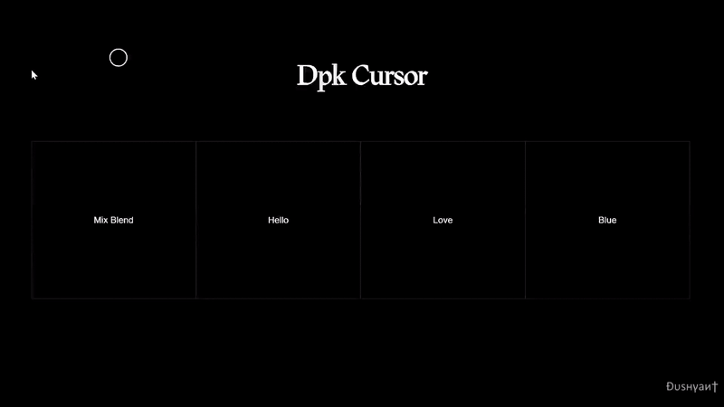

# dpkCursor.js

#### High performance smooth custom cursor library that helps you to create cool things.

#

<p align="left">        
    <a href="#">
        
    </a>
</p>

##### [Play with Codepen]

#

### How to use:

##### CSS

[Add dpkCursor.min.css]  or  [CDN dpkCursor.min.css]

##### JAVASCRIPT

[Add dpkCursor.min.js]   or  [CDN dpkcursor.min.js]

#

##### USAGE

```HTML


<link rel="stylesheet" href="dpkCursor.min.css" />

<div class="dpk-hover" data-hover-text="Hello"> Text </div>
<div class="dpk-hover" data-hover-class="class-name"> Add class to cursor </div>
<div class="dpk-hover" data-hover-bg="#222"> Background Color </div>
<div class="dpk-hover" data-hover-img="img/a.png"> Add Image As Background </div>

<script src="dpkCursor.min.js"></script>

<script>
    const customCursor = new dpkCursor({ ease: 0.25 });
</script>


```

#### Installation Using NPM

```sh
npm install dpk_cursor

import { dpkCursor } from "dpk_cursor/src/dpkCursor";

const customCursor = new dpkCursor({ ease: 0.25 });

```

#

##### HTML Element attributes

#

| Attribute          | Values           | Description         |
| ------------------ | ---------------- | ------------------- |
| `data-hover-text`  | string           | text inside Cursor  |
| `data-hover-class` | string           | add class to Cursor |
| `data-hover-bg`    | color- name/code | bg Color of Circle  |
| `data-hover-img`   | img/path         | img inside Cursor   |

#

##### dpkCursor Provides Following Functions

#

| Name              | Parameter | Defaults | Desc             |
| ----------------- | --------- | -------- | ---------------- |
| `init()`          | -         |          | initialization   |
| `effect()`        | -         | -        | Use the Effects  |
| `reset()`         | -         | -        | reset dpkCursor  |
| `destroy()`       | -         | -        | delete dpkCursor |

#

[cdn link dpkcursor.min.js]: https://cdn.jsdelivr.net/gh/Dushyant1295/dpkCursor/dpkCursor.min.js
[cdn link dpkcursor.min.css]: https://cdn.jsdelivr.net/gh/Dushyant1295/dpkCursor/dpkCursor.min.css
[play with it on codepen]: https://codepen.io/dushyant1295/pen/JjWrwZa
[add the dpkcursor.min.css]: https://github.com/Dushyant1295/dpkCursor/blob/master/dpkCursor.min.css
[add the dpkcursor.min.js]: https://github.com/Dushyant1295/dpkCursor/blob/master/dpkCursor.min.js
